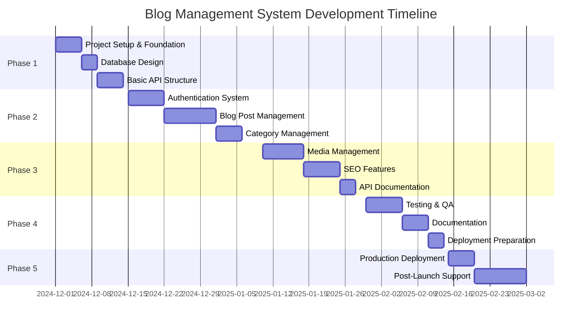
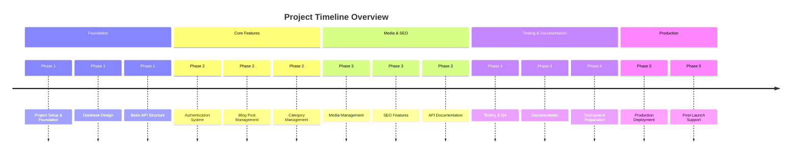
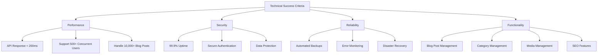
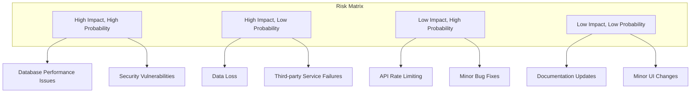
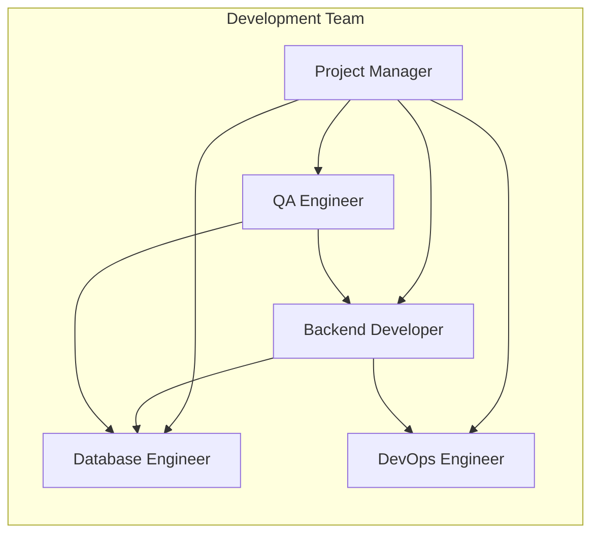

# Project Roadmap

## Blog Management System

**Version:** 1.0  
**Date:** December 2024  
**Project:** Blog Management System with Go and PostgreSQL

---

## Table of Contents

1. [Project Overview](#1-project-overview)
2. [Development Phases](#2-development-phases)
3. [Phase Details](#3-phase-details)
4. [Timeline](#4-timeline)
5. [Success Criteria](#5-success-criteria)
6. [Risk Management](#6-risk-management)
7. [Resource Requirements](#7-resource-requirements)

---

## 1. Project Overview

### 1.1 Project Vision

Build a simple, efficient blog management system that provides easy-to-use APIs for creating, managing, and publishing blog posts with categories, SEO optimization, and image support.

### 1.2 Project Goals

- Create a lightweight blog management system
- Provide simple blog post creation and management
- Support categories and SEO features
- Enable image upload and management
- Ensure fast and reliable performance

### 1.3 Technology Stack

- **Backend:** Go (Gin/Echo framework)
- **Database:** PostgreSQL
- **Authentication:** JWT
- **File Storage:** S3-compatible storage
- **API:** REST
- **Documentation:** Swagger/OpenAPI

---

## 2. Development Phases

---

## 3. Phase Details

### Phase 1: Foundation & Setup (Week 1)

#### 3.1.1 Project Setup & Foundation

**Duration:** 5 days  
**Priority:** Critical

**Tasks:**

- [ ] Initialize Go project structure
- [ ] Set up development environment
- [ ] Configure Git repository
- [ ] Set up basic CI/CD pipeline
- [ ] Create project documentation structure
- [ ] Set up code quality tools
- [ ] Configure development database

**Deliverables:**

- Project repository with proper structure
- Development environment setup guide
- Basic CI/CD pipeline
- Code quality configuration

**Success Criteria:**

- All team members can run the project locally
- Code quality tools are integrated
- Basic project structure is established

#### 3.1.2 Database Design

**Duration:** 3 days  
**Priority:** Critical

**Tasks:**

- [ ] Design database schema for blog posts, categories, users, and media
- [ ] Create database migration system
- [ ] Implement database connection pooling
- [ ] Create database seeding scripts
- [ ] Design database indexing strategy

**Deliverables:**

- Complete database schema design
- Migration system implementation
- Database connection configuration

**Success Criteria:**

- All core tables are created and functional
- Migrations can be run successfully
- Database performance is optimized

#### 3.1.3 Basic API Structure

**Duration:** 5 days  
**Priority:** Critical

**Tasks:**

- [ ] Set up HTTP server with Gin/Echo
- [ ] Implement basic routing structure
- [ ] Create middleware framework
- [ ] Set up configuration management
- [ ] Implement basic error handling
- [ ] Create health check endpoints
- [ ] Set up logging system

**Deliverables:**

- Basic HTTP server implementation
- Middleware framework
- Configuration management system
- Logging infrastructure

**Success Criteria:**

- Server starts successfully
- Health check endpoints respond correctly
- Logging is functional
- Configuration is environment-aware

---

### Phase 2: Core Features (Weeks 2-3)

#### 3.2.1 Authentication System

**Duration:** 7 days  
**Priority:** Critical

**Tasks:**

- [ ] Implement JWT token generation and validation
- [ ] Create login/logout endpoints
- [ ] Implement password hashing (bcrypt)
- [ ] Set up refresh token mechanism
- [ ] Implement rate limiting for auth endpoints
- [ ] Create password reset functionality
- [ ] Add role-based access control (Admin, Author)

**Deliverables:**

- Complete authentication system
- JWT token management
- Password reset functionality
- Role-based access control

**Success Criteria:**

- Users can register and login successfully
- JWT tokens are properly validated
- Password reset works correctly
- Role-based access is functional

#### 3.2.2 Blog Post Management

**Duration:** 10 days  
**Priority:** Critical

**Tasks:**

- [ ] Implement blog post CRUD operations
- [ ] Create rich text editor integration
- [ ] Add draft and published states
- [ ] Implement post scheduling
- [ ] Add excerpt/summary functionality
- [ ] Create post search and filtering
- [ ] Implement pagination
- [ ] Add tags support

**Deliverables:**

- Complete blog post management system
- Rich text editing capabilities
- Draft and publishing workflow
- Search and filtering functionality

**Success Criteria:**

- Blog posts can be created, updated, and deleted
- Rich text editing works correctly
- Draft and publishing states function properly
- Search and filtering work as expected

#### 3.2.3 Category Management

**Duration:** 5 days  
**Priority:** High

**Tasks:**

- [ ] Implement category CRUD operations
- [ ] Add category hierarchy support
- [ ] Create category assignment to posts
- [ ] Add category images/icons
- [ ] Implement category-based filtering

**Deliverables:**

- Complete category management system
- Category hierarchy functionality
- Category assignment to posts
- Category-based filtering

**Success Criteria:**

- Categories can be created and managed
- Category hierarchy works correctly
- Posts can be assigned to categories
- Category filtering functions properly

---

### Phase 3: Media & SEO (Weeks 4-5)

#### 3.3.1 Media Management

**Duration:** 8 days  
**Priority:** High

**Tasks:**

- [ ] Implement image upload system
- [ ] Create image processing capabilities
- [ ] Add file type validation
- [ ] Implement image optimization
- [ ] Create media library interface
- [ ] Add image search and filtering
- [ ] Implement alt text support
- [ ] Add featured image functionality

**Deliverables:**

- Complete media management system
- Image processing capabilities
- Media library
- Featured image support

**Success Criteria:**

- Image uploads work correctly
- Image processing functions properly
- Media library is searchable
- Featured images work as expected

#### 3.3.2 SEO Features

**Duration:** 7 days  
**Priority:** Medium

**Tasks:**

- [ ] Implement meta title and description
- [ ] Add Open Graph tags
- [ ] Create schema markup generation
- [ ] Implement custom URL slugs
- [ ] Add XML sitemap generation
- [ ] Create SEO preview functionality

**Deliverables:**

- Complete SEO management system
- Meta tag management
- Open Graph support
- Sitemap generation

**Success Criteria:**

- Meta tags are properly set
- Open Graph tags work correctly
- Schema markup is generated
- Sitemaps are functional

#### 3.3.3 API Documentation

**Duration:** 3 days  
**Priority:** Medium

**Tasks:**

- [ ] Set up Swagger/OpenAPI documentation
- [ ] Document all API endpoints
- [ ] Create API usage examples
- [ ] Add authentication documentation

**Deliverables:**

- Complete API documentation
- Interactive API explorer
- Usage examples

**Success Criteria:**

- All endpoints are documented
- API explorer is functional
- Documentation is clear and comprehensive

---

### Phase 4: Testing & Documentation (Week 6)

#### 3.4.1 Testing & QA

**Duration:** 7 days  
**Priority:** Critical

**Tasks:**

- [ ] Write unit tests for all components
- [ ] Create integration tests
- [ ] Implement end-to-end tests
- [ ] Perform load testing
- [ ] Conduct security testing
- [ ] Create automated test suite
- [ ] Set up test coverage reporting

**Deliverables:**

- Comprehensive test suite
- Test coverage reports
- Load testing results

**Success Criteria:**

- Test coverage is above 80%
- All critical paths are tested
- Load tests pass performance requirements
- No critical bugs remain

#### 3.4.2 Documentation

**Duration:** 5 days  
**Priority:** High

**Tasks:**

- [ ] Create user documentation
- [ ] Write developer documentation
- [ ] Create deployment guides
- [ ] Write troubleshooting guides
- [ ] Create API reference documentation

**Deliverables:**

- Complete user documentation
- Developer guides
- Deployment documentation

**Success Criteria:**

- Documentation is comprehensive
- Users can follow guides successfully
- Developers can contribute easily
- Deployment process is documented

#### 3.4.3 Deployment Preparation

**Duration:** 3 days  
**Priority:** High

**Tasks:**

- [ ] Create Docker containers
- [ ] Set up production environment
- [ ] Set up monitoring and alerting
- [ ] Create backup procedures
- [ ] Set up SSL certificates

**Deliverables:**

- Production-ready deployment
- Monitoring and alerting
- Backup and recovery procedures

**Success Criteria:**

- Application deploys successfully
- Monitoring is functional
- Backups are automated
- SSL is properly configured

---

### Phase 5: Production & Support (Week 7)

#### 3.5.1 Production Deployment

**Duration:** 5 days  
**Priority:** Critical

**Tasks:**

- [ ] Deploy to staging environment
- [ ] Perform staging testing
- [ ] Deploy to production
- [ ] Set up production monitoring
- [ ] Configure production backups
- [ ] Perform production testing

**Deliverables:**

- Production deployment
- Production monitoring
- Production testing results

**Success Criteria:**

- Application is live and functional
- Monitoring is active
- Backups are working
- Performance meets requirements

#### 3.5.2 Post-Launch Support

**Duration:** 10 days  
**Priority:** Medium

**Tasks:**

- [ ] Monitor system performance
- [ ] Address user feedback
- [ ] Fix production bugs
- [ ] Optimize based on usage
- [ ] Create support documentation
- [ ] Plan future enhancements

**Deliverables:**

- Stable production system
- Support documentation
- Future enhancement plan

**Success Criteria:**

- System is stable and reliable
- Users are supported effectively
- Future roadmap is defined

---

## 4. Timeline

### 4.1 Milestone Schedule

| Milestone                  | Target Date | Description                                |
| -------------------------- | ----------- | ------------------------------------------ |
| M1: Foundation Complete    | Week 1      | Basic project structure and API foundation |
| M2: Core Features Complete | Week 3      | Authentication, blog posts, and categories |
| M3: Media & SEO Complete   | Week 5      | Media management and SEO features          |
| M4: Testing Complete       | Week 6      | Comprehensive testing and documentation    |
| M5: Production Ready       | Week 7      | Live production system                     |

---

## 5. Success Criteria

### 5.1 Technical Success Criteria

### 5.2 Business Success Criteria

- [ ] System supports blog post creation and management
- [ ] Categories work correctly
- [ ] Media upload and management is functional
- [ ] SEO features are implemented
- [ ] System is production-ready
- [ ] Documentation is complete
- [ ] Performance meets requirements

---

## 6. Risk Management

### 6.1 Risk Assessment Matrix

### 6.2 Risk Mitigation Strategies

| Risk                        | Probability | Impact | Mitigation Strategy                         |
| --------------------------- | ----------- | ------ | ------------------------------------------- |
| Database Performance Issues | High        | High   | Query optimization, indexing, read replicas |
| Security Vulnerabilities    | Medium      | High   | Regular security audits, input validation   |
| Data Loss                   | Low         | High   | Automated backups, disaster recovery        |
| API Rate Limiting           | High        | Low    | Implement proper rate limiting              |
| Minor Bug Fixes             | High        | Low    | Comprehensive testing                       |

---

## 7. Resource Requirements

### 7.1 Team Structure

### 7.2 Technology Stack Requirements

| Component         | Technology | Version | Purpose                     |
| ----------------- | ---------- | ------- | --------------------------- |
| Backend Framework | Go         | 1.21+   | Main application server     |
| Database          | PostgreSQL | 15+     | Primary data storage        |
| HTTP Framework    | Gin/Echo   | Latest  | HTTP routing and middleware |
| ORM               | GORM       | Latest  | Database operations         |
| Authentication    | JWT        | -       | Token-based authentication  |
| File Storage      | S3/MinIO   | -       | Media storage               |
| Monitoring        | Prometheus | -       | Metrics collection          |
| Logging           | ELK Stack  | -       | Log aggregation             |

### 7.3 Infrastructure Requirements

| Environment | CPU      | RAM  | Storage | Purpose                |
| ----------- | -------- | ---- | ------- | ---------------------- |
| Development | 2 cores  | 4GB  | 50GB    | Local development      |
| Staging     | 4 cores  | 8GB  | 100GB   | Testing and validation |
| Production  | 4+ cores | 8GB+ | 200GB+  | Live application       |

---

## 8. Conclusion

This roadmap provides a focused plan for developing a blog management system using Go and PostgreSQL. The simplified approach ensures that essential blog features are delivered quickly while maintaining quality and security.

The timeline is realistic and accounts for testing, documentation, and deployment activities. The system will be lightweight, efficient, and focused on blog management needs.

---

**Document Version:** 1.0  
**Last Updated:** December 2024  
**Next Review:** January 2025
