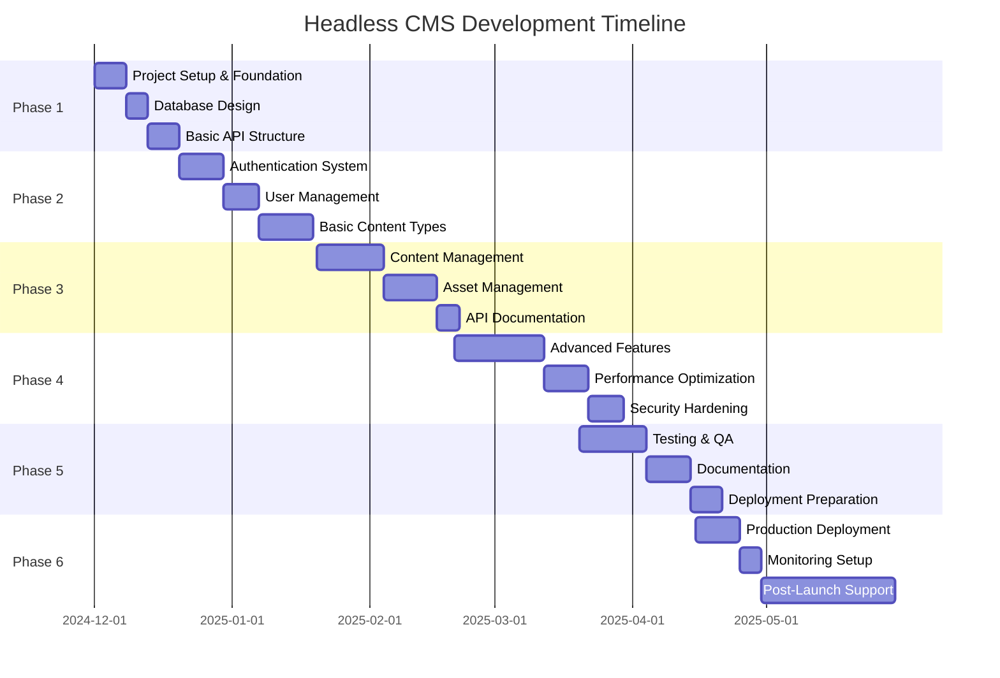
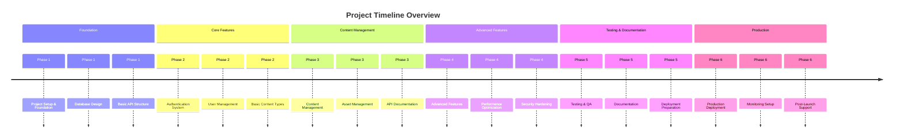
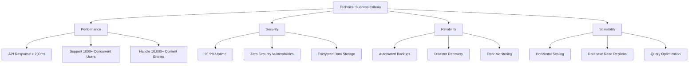
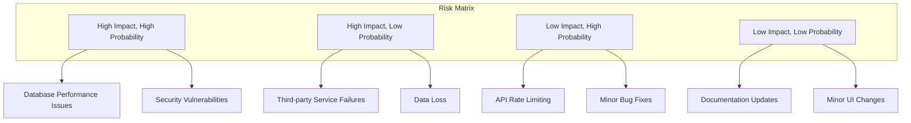
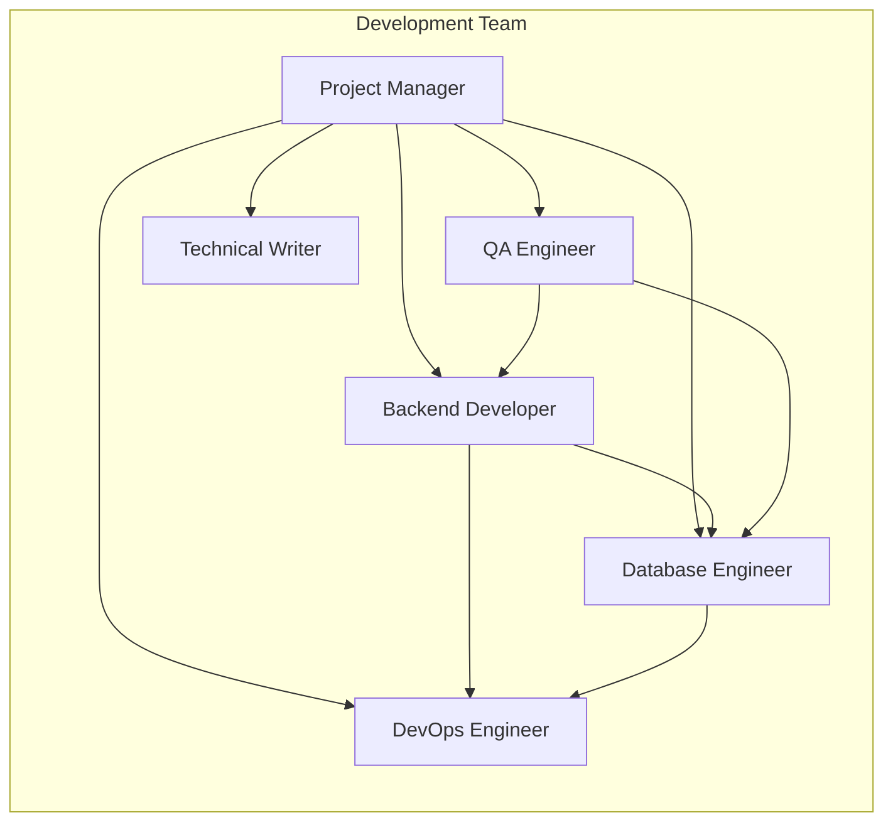

# Project Roadmap

## Headless Content Management System (CMS)

**Version:** 1.0  
**Date:** December 2024  
**Project:** Headless CMS with Go and PostgreSQL

---

## Table of Contents

1. [Project Overview](#1-project-overview)
2. [Development Phases](#2-development-phases)
3. [Phase Details](#3-phase-details)
4. [Timeline](#4-timeline)
5. [Success Criteria](#5-success-criteria)
6. [Risk Management](#6-risk-management)
7. [Resource Requirements](#7-resource-requirements)

---

## 1. Project Overview

### 1.1 Project Vision

Build a modern, scalable, and flexible headless CMS that provides robust content management capabilities through RESTful APIs and GraphQL, enabling seamless content delivery to multiple platforms.

### 1.2 Project Goals

- Create a performant and scalable content management system
- Provide flexible content modeling capabilities
- Ensure enterprise-grade security and reliability
- Support multiple content delivery channels
- Enable easy integration with modern frontend frameworks

### 1.3 Technology Stack

- **Backend:** Go (Gin/Echo framework)
- **Database:** PostgreSQL
- **Authentication:** JWT
- **File Storage:** S3-compatible storage
- **API:** REST + GraphQL
- **Documentation:** Swagger/OpenAPI

---

## 2. Development Phases

---

## 3. Phase Details

### Phase 1: Foundation & Setup (Weeks 1-3)

#### 3.1.1 Project Setup & Foundation

**Duration:** 1 week  
**Priority:** Critical

**Tasks:**

- [ ] Initialize Go project structure
- [ ] Set up development environment
- [ ] Configure Git repository and branching strategy
- [ ] Set up CI/CD pipeline basics
- [ ] Create project documentation structure
- [ ] Set up code quality tools (linters, formatters)
- [ ] Configure development database

**Deliverables:**

- Project repository with proper structure
- Development environment setup guide
- Basic CI/CD pipeline
- Code quality configuration

**Success Criteria:**

- All team members can run the project locally
- Code quality tools are integrated
- Basic project structure is established

#### 3.1.2 Database Design

**Duration:** 1 week  
**Priority:** Critical

**Tasks:**

- [ ] Design database schema for core entities
- [ ] Create database migration system
- [ ] Implement database connection pooling
- [ ] Set up database backup strategy
- [ ] Create database seeding scripts
- [ ] Design database indexing strategy

**Deliverables:**

- Complete database schema design
- Migration system implementation
- Database connection configuration
- Backup and recovery procedures

**Success Criteria:**

- All core tables are created and functional
- Migrations can be run successfully
- Database performance is optimized

#### 3.1.3 Basic API Structure

**Duration:** 1 week  
**Priority:** Critical

**Tasks:**

- [ ] Set up HTTP server with Gin/Echo
- [ ] Implement basic routing structure
- [ ] Create middleware framework
- [ ] Set up configuration management
- [ ] Implement basic error handling
- [ ] Create health check endpoints
- [ ] Set up logging system

**Deliverables:**

- Basic HTTP server implementation
- Middleware framework
- Configuration management system
- Logging infrastructure

**Success Criteria:**

- Server starts successfully
- Health check endpoints respond correctly
- Logging is functional
- Configuration is environment-aware

---

### Phase 2: Core Authentication & User Management (Weeks 4-7)

#### 3.2.1 Authentication System

**Duration:** 2 weeks  
**Priority:** Critical

**Tasks:**

- [ ] Implement JWT token generation and validation
- [ ] Create login/logout endpoints
- [ ] Implement password hashing (bcrypt)
- [ ] Set up refresh token mechanism
- [ ] Implement rate limiting for auth endpoints
- [ ] Create password reset functionality
- [ ] Add multi-factor authentication (MFA)
- [ ] Implement session management

**Deliverables:**

- Complete authentication system
- JWT token management
- Password reset functionality
- MFA implementation

**Success Criteria:**

- Users can register and login successfully
- JWT tokens are properly validated
- Password reset works correctly
- MFA is functional

#### 3.2.2 User Management

**Duration:** 1.5 weeks  
**Priority:** High

**Tasks:**

- [ ] Create user CRUD operations
- [ ] Implement role-based access control (RBAC)
- [ ] Create permission system
- [ ] Implement user profile management
- [ ] Add user activity logging
- [ ] Create user search and filtering
- [ ] Implement user import/export

**Deliverables:**

- Complete user management system
- RBAC implementation
- Permission management
- User activity tracking

**Success Criteria:**

- All user operations work correctly
- RBAC is properly enforced
- Permissions are granular and flexible
- User activity is logged

#### 3.2.3 Basic Content Types

**Duration:** 2 weeks  
**Priority:** High

**Tasks:**

- [ ] Design content type schema system
- [ ] Implement content type CRUD operations
- [ ] Create field type system (text, number, date, etc.)
- [ ] Implement content type validation
- [ ] Create content type versioning
- [ ] Add content type templates
- [ ] Implement content type search

**Deliverables:**

- Content type management system
- Flexible field type system
- Content type validation
- Versioning system

**Success Criteria:**

- Content types can be created and managed
- Field types are flexible and extensible
- Validation works correctly
- Versioning is functional

---

### Phase 3: Content & Asset Management (Weeks 8-12)

#### 3.3.1 Content Management

**Duration:** 3 weeks  
**Priority:** Critical

**Tasks:**

- [ ] Implement content entry CRUD operations
- [ ] Create content versioning system
- [ ] Implement content scheduling (publish/unpublish)
- [ ] Add content localization (multi-language)
- [ ] Create content search and filtering
- [ ] Implement content relationships
- [ ] Add content import/export functionality
- [ ] Create content approval workflow
- [ ] Implement content analytics

**Deliverables:**

- Complete content management system
- Content versioning and scheduling
- Multi-language support
- Content relationships and workflows

**Success Criteria:**

- Content can be created, updated, and deleted
- Versioning works correctly
- Scheduling functions properly
- Multi-language content is supported

#### 3.3.2 Asset Management

**Duration:** 2.5 weeks  
**Priority:** High

**Tasks:**

- [ ] Implement file upload system
- [ ] Create image processing capabilities
- [ ] Add file type validation
- [ ] Implement asset optimization
- [ ] Create media library interface
- [ ] Add asset search and filtering
- [ ] Implement asset versioning
- [ ] Create CDN integration
- [ ] Add asset analytics

**Deliverables:**

- Complete asset management system
- Image processing capabilities
- Media library
- CDN integration

**Success Criteria:**

- File uploads work correctly
- Image processing functions properly
- Media library is searchable
- CDN integration is functional

#### 3.3.3 API Documentation

**Duration:** 1 week  
**Priority:** Medium

**Tasks:**

- [ ] Set up Swagger/OpenAPI documentation
- [ ] Document all API endpoints
- [ ] Create API usage examples
- [ ] Add authentication documentation
- [ ] Create SDK documentation
- [ ] Implement interactive API explorer

**Deliverables:**

- Complete API documentation
- Interactive API explorer
- SDK documentation
- Usage examples

**Success Criteria:**

- All endpoints are documented
- API explorer is functional
- Documentation is clear and comprehensive

---

### Phase 4: Advanced Features & Optimization (Weeks 13-17)

#### 3.4.1 Advanced Features

**Duration:** 4 weeks  
**Priority:** Medium

**Tasks:**

- [ ] Implement GraphQL API
- [ ] Create webhook system
- [ ] Add real-time notifications
- [ ] Implement content preview system
- [ ] Create content templates
- [ ] Add bulk operations
- [ ] Implement content scheduling
- [ ] Create content analytics dashboard
- [ ] Add API rate limiting
- [ ] Implement caching strategies

**Deliverables:**

- GraphQL API implementation
- Webhook system
- Real-time notifications
- Content analytics

**Success Criteria:**

- GraphQL queries work correctly
- Webhooks are reliable
- Real-time features function properly
- Analytics provide meaningful insights

#### 3.4.2 Performance Optimization

**Duration:** 2 weeks  
**Priority:** High

**Tasks:**

- [ ] Implement database query optimization
- [ ] Optimize API response times
- [ ] Implement connection pooling
- [ ] Add database read replicas
- [ ] Optimize file upload performance
- [ ] Implement lazy loading
- [ ] Add performance monitoring

**Deliverables:**

- Optimized database queries
- Performance monitoring
- Load testing results

**Success Criteria:**

- API response times are under 200ms
- Database queries are optimized
- System handles expected load

#### 3.4.3 Security Hardening

**Duration:** 1.5 weeks  
**Priority:** Critical

**Tasks:**

- [ ] Implement input validation and sanitization
- [ ] Add SQL injection prevention
- [ ] Implement XSS protection
- [ ] Add CSRF protection
- [ ] Implement security headers
- [ ] Add audit logging
- [ ] Create security monitoring
- [ ] Implement backup encryption
- [ ] Add penetration testing

**Deliverables:**

- Security-hardened application
- Audit logging system
- Security monitoring
- Penetration test results

**Success Criteria:**

- All security vulnerabilities are addressed
- Audit logs are comprehensive
- Security monitoring is active
- Penetration tests pass

---

### Phase 5: Testing & Documentation (Weeks 18-21)

#### 3.5.1 Testing & QA

**Duration:** 3 weeks  
**Priority:** Critical

**Tasks:**

- [ ] Write unit tests for all components
- [ ] Create integration tests
- [ ] Implement end-to-end tests
- [ ] Perform load testing
- [ ] Conduct security testing
- [ ] Create automated test suite
- [ ] Set up test coverage reporting
- [ ] Perform user acceptance testing
- [ ] Create bug tracking system

**Deliverables:**

- Comprehensive test suite
- Test coverage reports
- Load testing results
- Bug tracking system

**Success Criteria:**

- Test coverage is above 80%
- All critical paths are tested
- Load tests pass performance requirements
- No critical bugs remain

#### 3.5.2 Documentation

**Duration:** 2 weeks  
**Priority:** High

**Tasks:**

- [ ] Create user documentation
- [ ] Write developer documentation
- [ ] Create deployment guides
- [ ] Write troubleshooting guides
- [ ] Create video tutorials
- [ ] Write API reference documentation
- [ ] Create contribution guidelines
- [ ] Write maintenance procedures

**Deliverables:**

- Complete user documentation
- Developer guides
- Deployment documentation
- Video tutorials

**Success Criteria:**

- Documentation is comprehensive
- Users can follow guides successfully
- Developers can contribute easily
- Deployment process is documented

#### 3.5.3 Deployment Preparation

**Duration:** 1 week  
**Priority:** High

**Tasks:**

- [ ] Create Docker containers
- [ ] Set up Kubernetes manifests
- [ ] Configure production environment
- [ ] Set up monitoring and alerting
- [ ] Create backup procedures
- [ ] Set up SSL certificates
- [ ] Configure domain and DNS
- [ ] Create disaster recovery plan

**Deliverables:**

- Production-ready deployment
- Monitoring and alerting
- Backup and recovery procedures
- SSL configuration

**Success Criteria:**

- Application deploys successfully
- Monitoring is functional
- Backups are automated
- SSL is properly configured

---

### Phase 6: Production Deployment & Support (Weeks 22-26)

#### 3.6.1 Production Deployment

**Duration:** 2 weeks  
**Priority:** Critical

**Tasks:**

- [ ] Deploy to staging environment
- [ ] Perform staging testing
- [ ] Deploy to production
- [ ] Set up production monitoring
- [ ] Configure production backups
- [ ] Set up production alerts
- [ ] Perform production testing
- [ ] Create production runbooks

**Deliverables:**

- Production deployment
- Production monitoring
- Production runbooks
- Production testing results

**Success Criteria:**

- Application is live and functional
- Monitoring is active
- Backups are working
- Performance meets requirements

#### 3.6.2 Monitoring Setup

**Duration:** 1 week  
**Priority:** High

**Tasks:**

- [ ] Set up application monitoring
- [ ] Configure database monitoring
- [ ] Set up infrastructure monitoring
- [ ] Create alerting rules
- [ ] Set up log aggregation
- [ ] Create dashboards
- [ ] Set up performance monitoring
- [ ] Configure error tracking

**Deliverables:**

- Complete monitoring system
- Alerting configuration
- Performance dashboards
- Error tracking

**Success Criteria:**

- All systems are monitored
- Alerts are properly configured
- Dashboards provide insights
- Errors are tracked

#### 3.6.3 Post-Launch Support

**Duration:** 4 weeks  
**Priority:** Medium

**Tasks:**

- [ ] Monitor system performance
- [ ] Address user feedback
- [ ] Fix production bugs
- [ ] Optimize based on usage
- [ ] Create support documentation
- [ ] Set up user support system
- [ ] Plan future enhancements
- [ ] Create maintenance schedule

**Deliverables:**

- Stable production system
- User support system
- Maintenance procedures
- Future enhancement plan

**Success Criteria:**

- System is stable and reliable
- Users are supported effectively
- Maintenance procedures are clear
- Future roadmap is defined

---

## 4. Timeline

### 4.1 Milestone Schedule

| Milestone                       | Target Date | Description                                |
| ------------------------------- | ----------- | ------------------------------------------ |
| M1: Foundation Complete         | Week 3      | Basic project structure and API foundation |
| M2: Authentication Complete     | Week 7      | User authentication and management system  |
| M3: Content Management Complete | Week 12     | Full content and asset management          |
| M4: Advanced Features Complete  | Week 17     | GraphQL, webhooks, and optimizations       |
| M5: Testing Complete            | Week 21     | Comprehensive testing and documentation    |
| M6: Production Ready            | Week 26     | Live production system with monitoring     |

---

## 5. Success Criteria

### 5.1 Technical Success Criteria

### 5.2 Business Success Criteria

- [ ] System supports multiple content types
- [ ] API is fully documented and functional
- [ ] User management is comprehensive
- [ ] Asset management is efficient
- [ ] System is production-ready
- [ ] Monitoring and alerting are active
- [ ] Documentation is complete
- [ ] Performance meets requirements

---

## 6. Risk Management

### 6.1 Risk Assessment Matrix

### 6.2 Risk Mitigation Strategies

| Risk                         | Probability | Impact | Mitigation Strategy                                  |
| ---------------------------- | ----------- | ------ | ---------------------------------------------------- |
| Database Performance Issues  | High        | High   | Implement caching, query optimization, read replicas |
| Security Vulnerabilities     | Medium      | High   | Regular security audits, penetration testing         |
| Third-party Service Failures | Low         | High   | Implement fallback mechanisms, service monitoring    |
| Data Loss                    | Low         | High   | Automated backups, disaster recovery procedures      |
| API Rate Limiting            | High        | Low    | Implement proper rate limiting, monitoring           |
| Minor Bug Fixes              | High        | Low    | Comprehensive testing, bug tracking system           |

---

## 7. Resource Requirements

### 7.1 Team Structure

### 7.2 Technology Stack Requirements

| Component         | Technology | Version | Purpose                     |
| ----------------- | ---------- | ------- | --------------------------- |
| Backend Framework | Go         | 1.21+   | Main application server     |
| Database          | PostgreSQL | 15+     | Primary data storage        |
| HTTP Framework    | Gin/Echo   | Latest  | HTTP routing and middleware |
| ORM               | GORM       | Latest  | Database operations         |
| Authentication    | JWT        | -       | Token-based authentication  |
| File Storage      | S3/MinIO   | -       | Asset storage               |
| Monitoring        | Prometheus | -       | Metrics collection          |
| Logging           | ELK Stack  | -       | Log aggregation             |

### 7.3 Infrastructure Requirements

| Environment | CPU      | RAM   | Storage | Purpose                |
| ----------- | -------- | ----- | ------- | ---------------------- |
| Development | 2 cores  | 4GB   | 50GB    | Local development      |
| Staging     | 4 cores  | 8GB   | 100GB   | Testing and validation |
| Production  | 8+ cores | 16GB+ | 500GB+  | Live application       |

---

## 8. Conclusion

This roadmap provides a comprehensive plan for developing a modern headless CMS using Go and PostgreSQL. The phased approach ensures that critical features are delivered early while maintaining quality and security throughout the development process.

Each phase builds upon the previous one, creating a solid foundation for the next set of features. The timeline is realistic and accounts for testing, documentation, and deployment activities.

Regular reviews and adjustments to this roadmap will ensure the project stays on track and meets the evolving needs of stakeholders.

---

**Document Version:** 1.0  
**Last Updated:** December 2024  
**Next Review:** January 2025
