# Software Requirements Specification (SRS)

## Blog Management System

**Version:** 1.0  
**Date:** December 2024  
**Project:** Blog Management System with Go and PostgreSQL

---

## Table of Contents

1. [Introduction](#1-introduction)
2. [System Overview](#2-system-overview)
3. [Functional Requirements](#3-functional-requirements)
4. [Non-Functional Requirements](#4-non-functional-requirements)
5. [System Architecture](#5-system-architecture)
6. [Data Models](#6-data-models)
7. [API Specifications](#7-api-specifications)
8. [Security Requirements](#8-security-requirements)
9. [User Interface Requirements](#9-user-interface-requirements)
10. [Performance Requirements](#10-performance-requirements)
11. [Deployment Requirements](#11-deployment-requirements)

---

## 1. Introduction

### 1.1 Purpose

This document outlines the requirements for a modern blog management system built with Go and PostgreSQL. The system will provide a simple, efficient way to create, manage, and publish blog posts with categories, SEO optimization, and image support.

### 1.2 Scope

The blog management system will serve as a backend API that allows users to create and manage blog posts, categories, and media assets. It will provide RESTful APIs for blog content delivery to frontend applications.

### 1.3 Definitions

- **Blog Post**: An individual article or post with title, content, and metadata
- **Category**: A classification system for organizing blog posts
- **SEO**: Search Engine Optimization features for better discoverability
- **Media**: Images and other files associated with blog posts
- **API**: Application Programming Interface for content delivery

---

## 2. System Overview

### 2.1 System Context Diagram

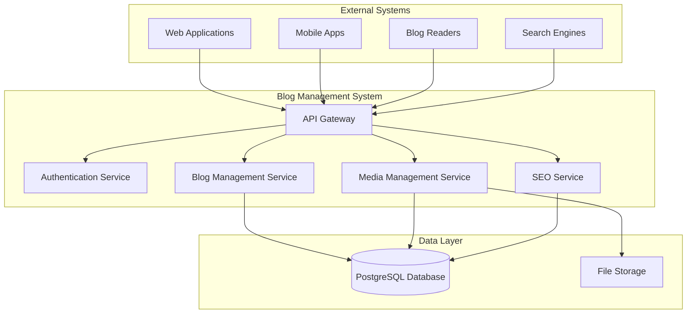

### 2.2 System Features Overview

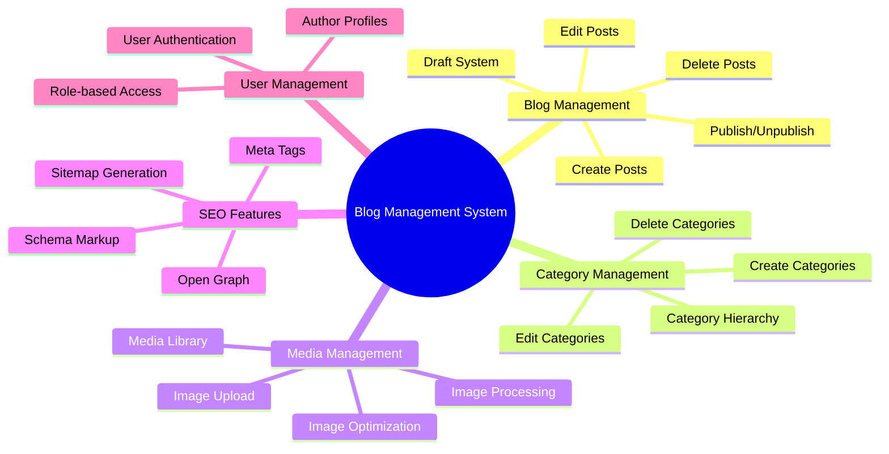

---

## 3. Functional Requirements

### 3.1 Blog Post Management

#### 3.1.1 Blog Post CRUD Operations

- **FR-001**: System shall allow creation of blog posts with title, content, and metadata
- **FR-002**: System shall support editing and updating of blog posts
- **FR-003**: System shall allow deletion of blog posts
- **FR-004**: System shall support draft and published states for posts
- **FR-005**: System shall allow scheduling of posts for future publication

#### 3.1.2 Blog Post Features

- **FR-006**: System shall support rich text content with formatting options
- **FR-007**: System shall allow assignment of categories to blog posts
- **FR-008**: System shall support tags for additional classification
- **FR-009**: System shall allow setting featured images for posts
- **FR-010**: System shall support excerpt/summary for posts

### 3.2 Category Management

#### 3.2.1 Category Operations

- **FR-011**: System shall allow creation of categories with name and description
- **FR-012**: System shall support editing and updating of categories
- **FR-013**: System shall allow deletion of categories
- **FR-014**: System shall support category hierarchy (parent-child relationships)
- **FR-015**: System shall allow setting category images/icons

### 3.3 Media Management

#### 3.3.1 Image Management

- **FR-016**: System shall support image upload with size and type validation
- **FR-017**: System shall provide image processing capabilities (resize, crop, format conversion)
- **FR-018**: System shall maintain a media library with search and filtering
- **FR-019**: System shall support image optimization for web delivery
- **FR-020**: System shall allow setting alt text for accessibility

### 3.4 SEO Features

#### 3.4.1 SEO Management

- **FR-021**: System shall allow setting meta title and description for posts
- **FR-022**: System shall support Open Graph tags for social media sharing
- **FR-023**: System shall generate schema markup for search engines
- **FR-024**: System shall support custom URL slugs for posts
- **FR-025**: System shall generate XML sitemaps automatically

### 3.5 User Management

#### 3.5.1 Authentication & Authorization

- **FR-026**: System shall provide secure user authentication (JWT tokens)
- **FR-027**: System shall support role-based access control (Admin, Author, Editor)
- **FR-028**: System shall allow user profile management
- **FR-029**: System shall support password reset functionality

### 3.6 API Services

#### 3.6.1 Content Delivery APIs

- **FR-030**: System shall provide RESTful APIs for blog post retrieval
- **FR-031**: System shall support filtering posts by category, tags, and date
- **FR-032**: System shall provide search functionality for posts
- **FR-033**: System shall support pagination for large post lists
- **FR-034**: System shall provide category listing and management APIs

---

## 4. Non-Functional Requirements

### 4.1 Performance Requirements

- **NFR-001**: API response time shall be < 200ms for 95% of requests
- **NFR-002**: System shall handle 500+ concurrent users
- **NFR-003**: System shall support 10,000+ blog posts
- **NFR-004**: Image upload shall support files up to 10MB

### 4.2 Scalability Requirements

- **NFR-005**: System shall be horizontally scalable
- **NFR-006**: Database shall support read replicas for performance

### 4.3 Security Requirements

- **NFR-007**: All API communications shall use HTTPS
- **NFR-008**: System shall implement rate limiting
- **NFR-009**: System shall support CORS configuration
- **NFR-010**: System shall implement input validation and sanitization

### 4.4 Availability Requirements

- **NFR-011**: System shall have 99.9% uptime
- **NFR-012**: System shall implement automated backups
- **NFR-013**: System shall support disaster recovery

---

## 5. System Architecture

### 5.1 High-Level Architecture

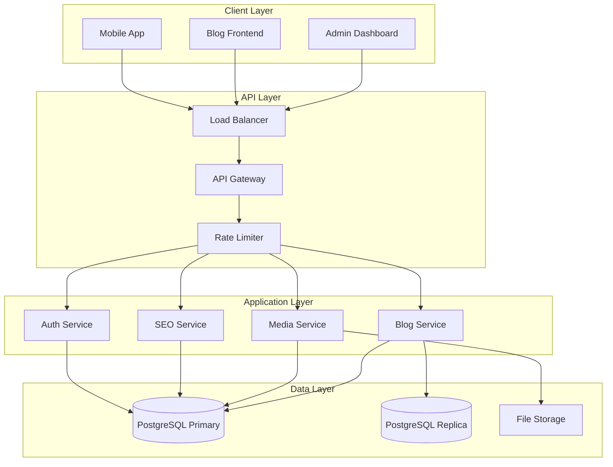

### 5.2 Database Schema Overview

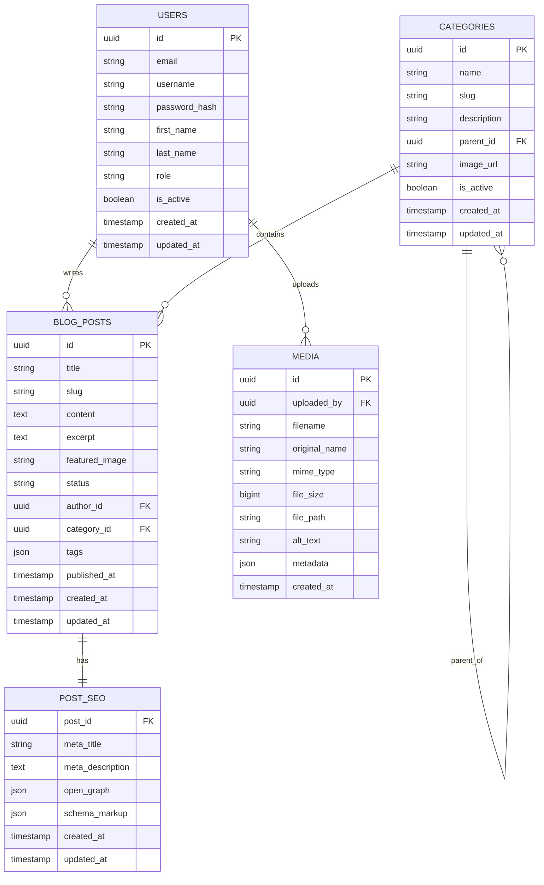

---

## 6. Data Models

### 6.1 Blog Post Structure

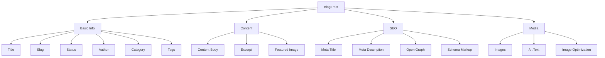

### 6.2 Blog Post Lifecycle

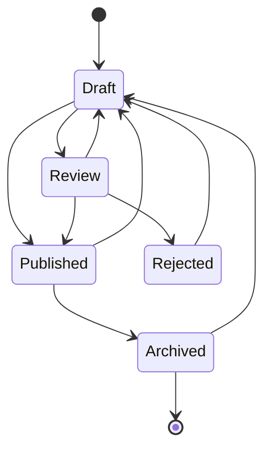

---

## 7. API Specifications

### 7.1 API Endpoints Overview

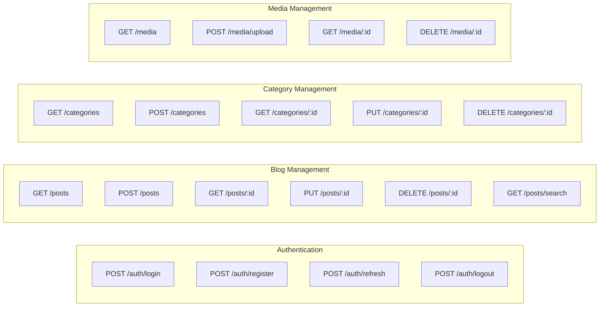

### 7.2 API Response Flow

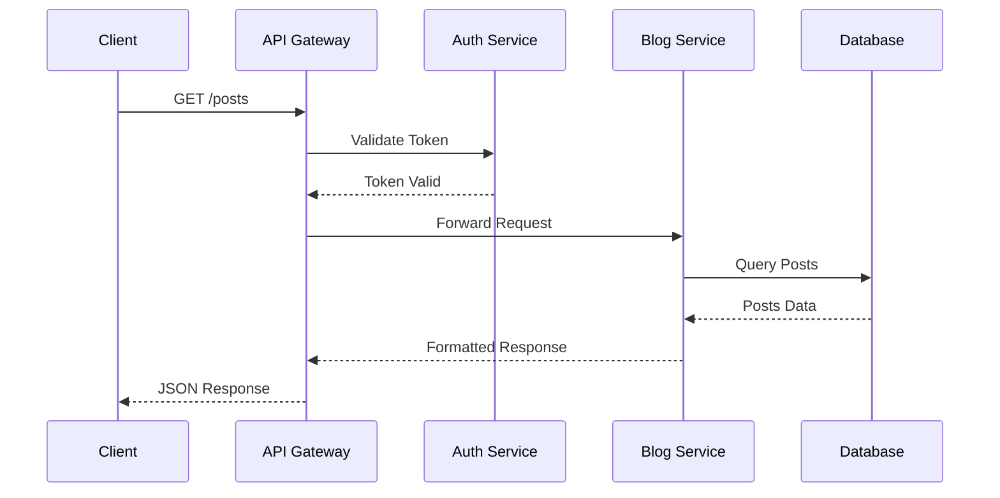

---

## 8. Security Requirements

### 8.1 Security Architecture

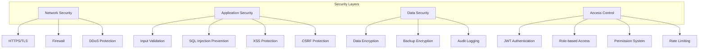

### 8.2 Authentication Flow

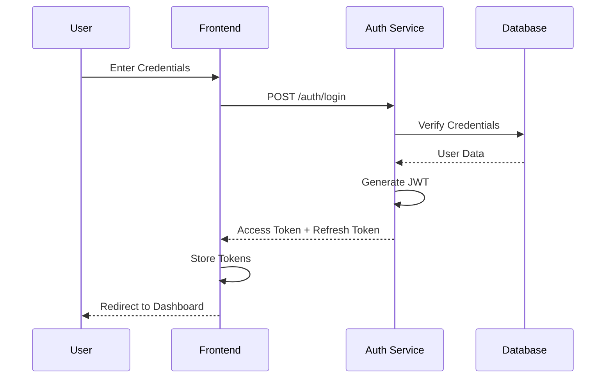

---

## 9. User Interface Requirements

### 9.1 Admin Dashboard Structure

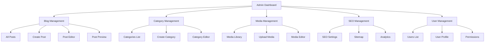

### 9.2 Blog Post Editor Interface

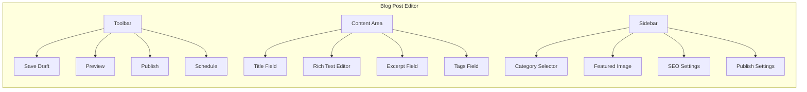

---

## 10. Performance Requirements

### 10.1 Performance Metrics Dashboard

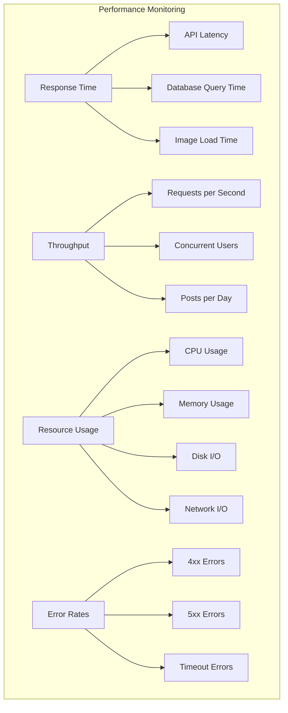

### 10.2 Performance Optimization Strategy

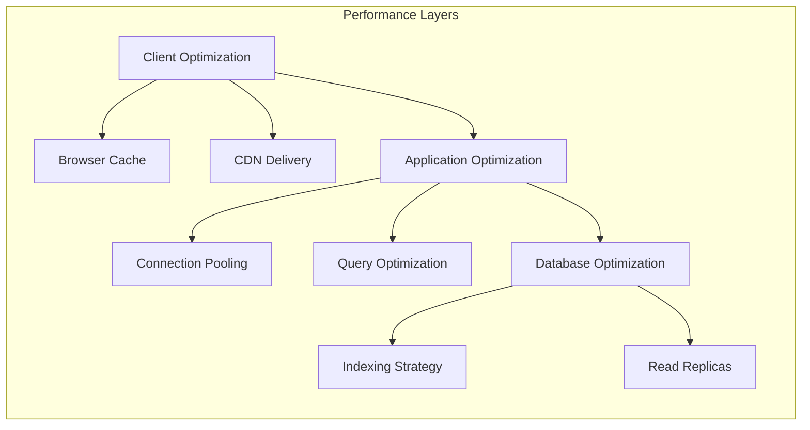

---

## 11. Deployment Requirements

### 11.1 Deployment Architecture

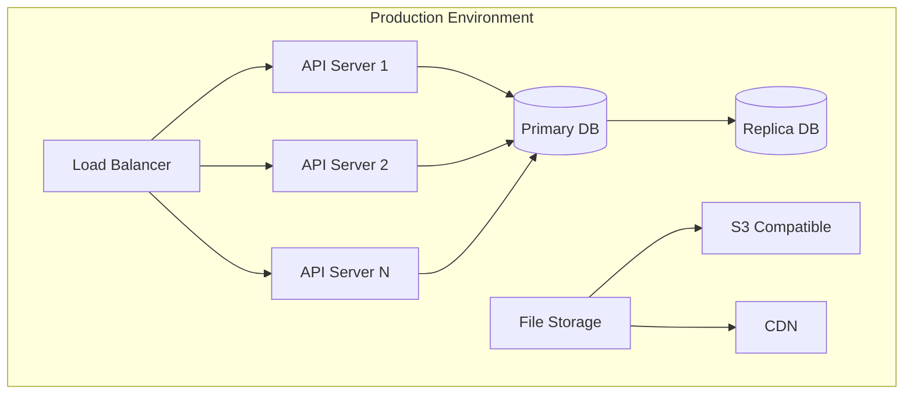

### 11.2 CI/CD Pipeline

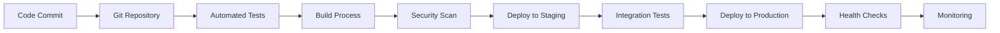

---

## 12. Conclusion

This SRS document provides a comprehensive overview of the blog management system requirements, architecture, and specifications. The system is designed to be simple, efficient, and focused on blog management with essential features like categories, SEO optimization, and media management.

The implementation will follow Go best practices and utilize PostgreSQL for robust data storage, ensuring the system can handle blog management needs effectively.

---

**Document Version:** 1.0  
**Last Updated:** December 2024  
**Next Review:** January 2025
