# Software Requirements Specification (SRS)

## Headless Content Management System (CMS)

**Version:** 1.0  
**Date:** December 2024  
**Project:** Headless CMS with Go and PostgreSQL

---

## Table of Contents

1. [Introduction](#1-introduction)
2. [System Overview](#2-system-overview)
3. [Functional Requirements](#3-functional-requirements)
4. [Non-Functional Requirements](#4-non-functional-requirements)
5. [System Architecture](#5-system-architecture)
6. [Data Models](#6-data-models)
7. [API Specifications](#7-api-specifications)
8. [Security Requirements](#8-security-requirements)
9. [User Interface Requirements](#9-user-interface-requirements)
10. [Performance Requirements](#10-performance-requirements)
11. [Deployment Requirements](#11-deployment-requirements)

---

## 1. Introduction

### 1.1 Purpose

This document outlines the requirements for a modern headless Content Management System (CMS) built with Go and PostgreSQL. The system will provide a robust, scalable, and flexible content management solution for web applications, mobile apps, and other digital platforms.

### 1.2 Scope

The headless CMS will serve as a content backend that provides content through RESTful APIs, allowing frontend applications to consume and display content dynamically.

### 1.3 Definitions

- **Headless CMS**: A content management system that provides content through APIs without a built-in frontend
- **Content Types**: Reusable templates for different kinds of content
- **Content Entries**: Individual pieces of content based on content types
- **Assets**: Media files (images, videos, documents) managed by the CMS
- **API**: Application Programming Interface for content delivery

---

## 2. System Overview

### 2.1 System Context Diagram

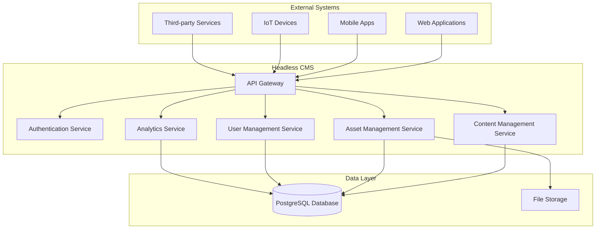

### 2.2 System Features Overview

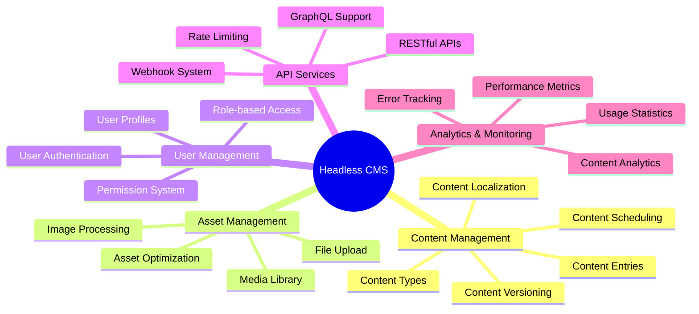

---

## 3. Functional Requirements

### 3.1 Content Management

#### 3.1.1 Content Types Management

- **FR-001**: System shall allow creation of custom content types with flexible field definitions
- **FR-002**: System shall support various field types (text, rich text, number, date, boolean, reference, media)
- **FR-003**: System shall allow content type validation rules
- **FR-004**: System shall support content type versioning

#### 3.1.2 Content Entries Management

- **FR-005**: System shall allow creation, reading, updating, and deletion of content entries
- **FR-006**: System shall support content versioning and rollback
- **FR-007**: System shall allow content scheduling (publish/unpublish dates)
- **FR-008**: System shall support content localization (multi-language)

### 3.2 Asset Management

#### 3.2.1 File Management

- **FR-009**: System shall support file upload with size and type validation
- **FR-010**: System shall provide image processing capabilities (resize, crop, format conversion)
- **FR-011**: System shall maintain a media library with search and filtering
- **FR-012**: System shall support asset optimization and CDN integration

### 3.3 User Management

#### 3.3.1 Authentication & Authorization

- **FR-013**: System shall provide secure user authentication (JWT tokens)
- **FR-014**: System shall support role-based access control (RBAC)
- **FR-015**: System shall allow granular permissions for content and assets
- **FR-016**: System shall support multi-factor authentication (MFA)

### 3.4 API Services

#### 3.4.1 Content Delivery APIs

- **FR-017**: System shall provide RESTful APIs for content retrieval
- **FR-018**: System shall support GraphQL queries for flexible data fetching
- **FR-019**: System shall implement API versioning
- **FR-020**: System shall provide webhook notifications for content changes

---

## 4. Non-Functional Requirements

### 4.1 Performance Requirements

- **NFR-001**: API response time shall be < 200ms for 95% of requests
- **NFR-002**: System shall handle 1000+ concurrent users
- **NFR-003**: System shall support 10,000+ content entries
- **NFR-004**: File upload shall support files up to 100MB

### 4.2 Scalability Requirements

- **NFR-005**: System shall be horizontally scalable
- **NFR-006**: Database shall support read replicas for performance

### 4.3 Security Requirements

- **NFR-008**: All API communications shall use HTTPS
- **NFR-009**: System shall implement rate limiting
- **NFR-010**: System shall support CORS configuration
- **NFR-011**: System shall implement input validation and sanitization

### 4.4 Availability Requirements

- **NFR-012**: System shall have 99.9% uptime
- **NFR-013**: System shall implement automated backups
- **NFR-014**: System shall support disaster recovery

---

## 5. System Architecture

### 5.1 High-Level Architecture

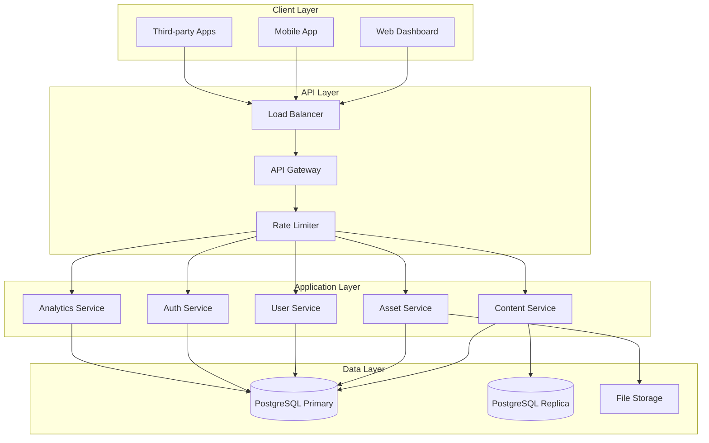

### 5.2 Microservices Architecture

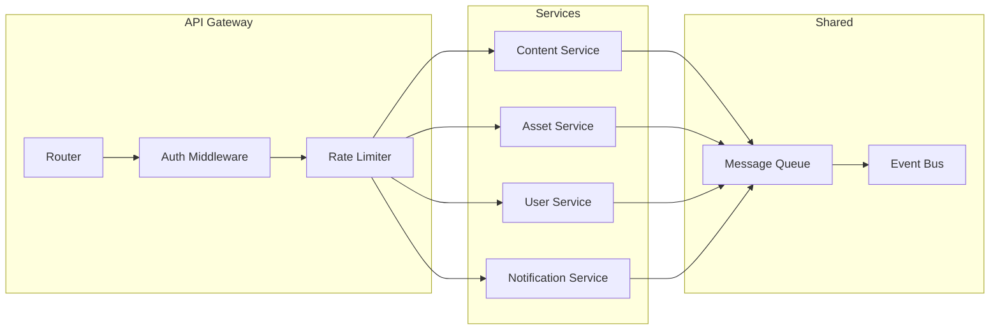

### 5.3 Database Schema Overview

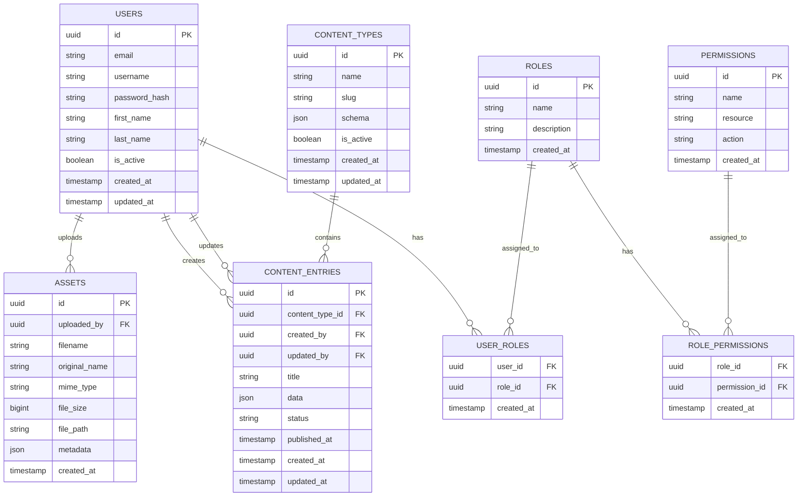

---

## 6. Data Models

### 6.1 Content Type Schema

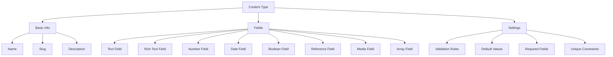

### 6.2 Content Entry Lifecycle

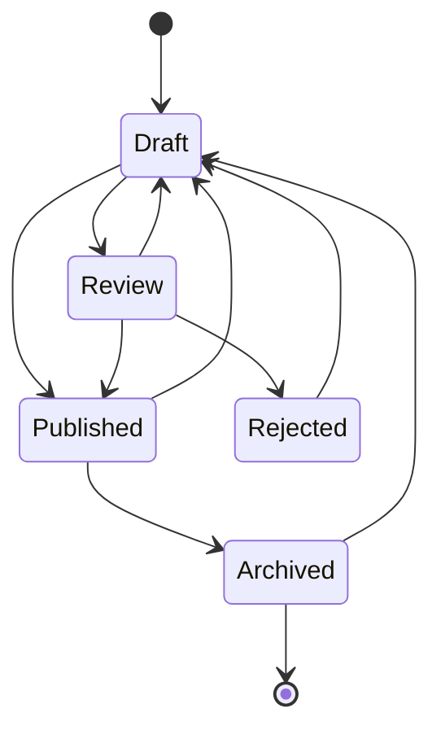

---

## 7. API Specifications

### 7.1 API Endpoints Overview

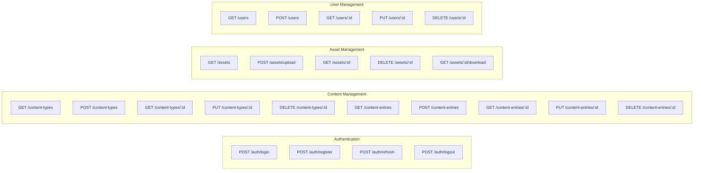

### 7.2 API Response Flow

---

## 8. Security Requirements

### 8.1 Security Architecture

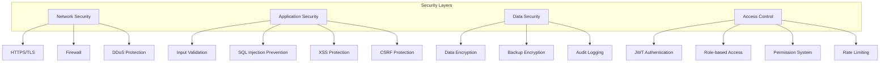

### 8.2 Authentication Flow

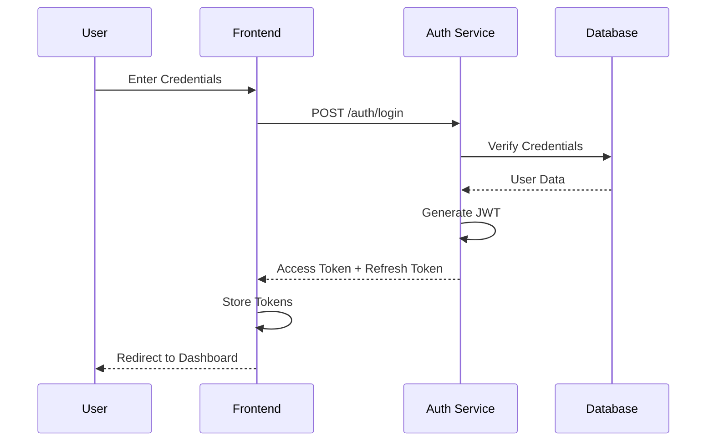

---

## 9. User Interface Requirements

### 9.1 Admin Dashboard Structure

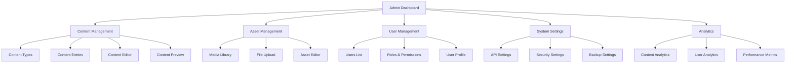

### 9.2 Content Editor Interface

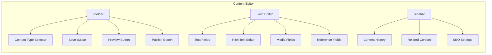

---

## 10. Performance Requirements

### 10.1 Performance Metrics Dashboard

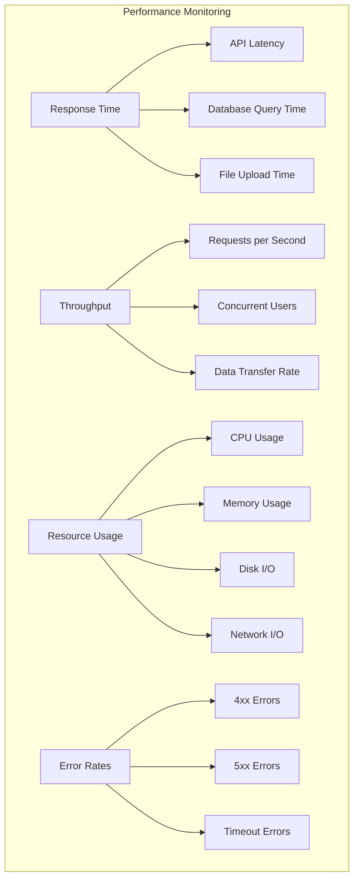

### 10.2 Performance Optimization Strategy

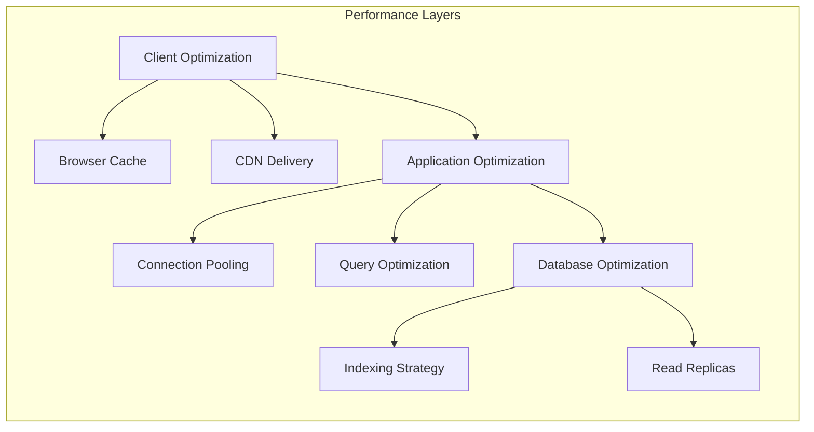

---

## 11. Deployment Requirements

### 11.1 Deployment Architecture

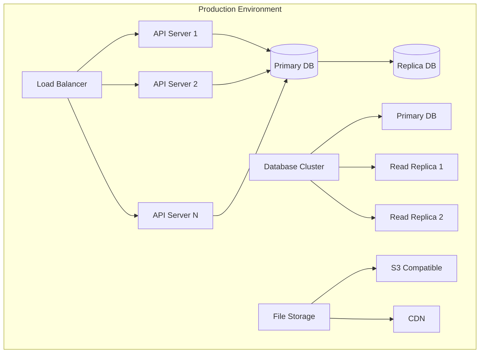

### 11.2 CI/CD Pipeline

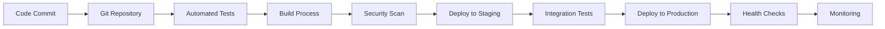

---

## 12. Conclusion

This SRS document provides a comprehensive overview of the headless CMS requirements, architecture, and specifications. The system is designed to be scalable, secure, and performant while providing flexible content management capabilities through modern APIs.

The implementation will follow Go best practices and utilize PostgreSQL for robust data storage, ensuring the system can handle enterprise-level content management needs.

---

**Document Version:** 1.0  
**Last Updated:** December 2024  
**Next Review:** January 2025
